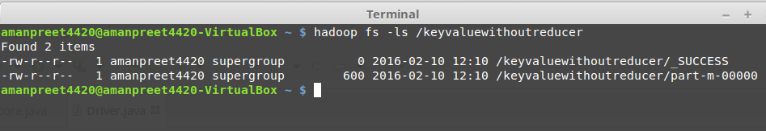

# Fifth MapReduce project without Reducers #

- Use Case
	- We will run *Fourth MapReduce project using Custom Data Types* project without Reducers

- Create a copy of package *keyvaluecustomdatatype* into new package named *keyvaluewithoutreducer*

- In the Driver class, set the number of reducer to 0

	> job.setNumReduceTasks(0);

- Now run the MapReduce program
	- Create the JAR file and run the Job from Terminal using

		*hadoop jar /home/amanpreet4420/MapReduceJARs/keyvaluewithoutreducer.jar keyvaluewithoutreducer.Driver /datakeyvalue/keyvalue /keyvaluewithoutreducer*

	- After the job is executed, see the output in *keyvaluewithoutreducer*
 
		

		- _SUCCESS: this is a flag file, stating that the operation was successful
		- part-m-00000: this is the file containing the final output. As the reducer was not run, Mapper writes output to HDFS

	- Content of the file are below:
	
		