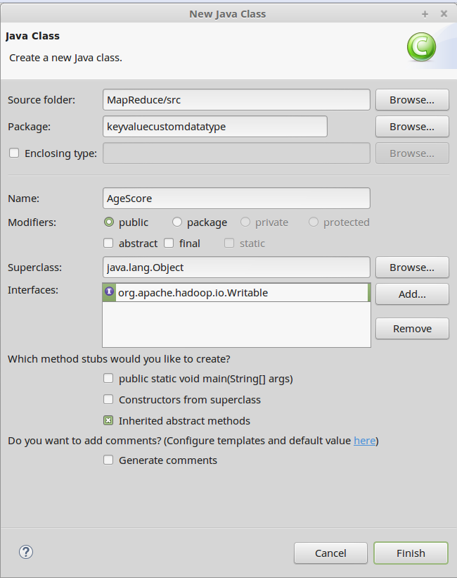
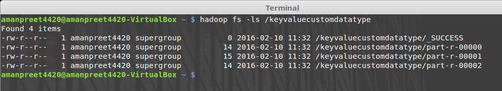
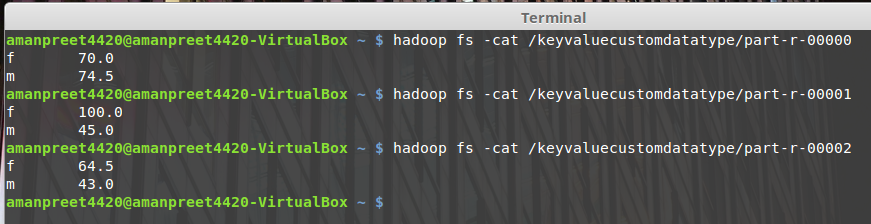

# Fourth MapReduce project using Custom Data Types #

- Use Case
	- This project is built on top of *Third MapReduce project using KeyValueTextInputFormat* project.

	- In this Use Case, we will use custom data type instead of outputting age, score as Text from mapper and input to reducer

- Create a copy of *keyvaluecustompartitioner* package into *keyvaluecustomdatatype*

- Create a class *AgeScore*
	- Add Interface *org.apache.hadoop.io.Writable*

		

	- In the class add two properties
	
		> IntWritable age = new IntWritable();
	
		> IntWritable score = new IntWritable();

	- Update the readFields(..) method as below

		>     public void readFields(DataInput in) throws IOException {
		>     		
		>     	age.readFields(in);
		>     	score.readFields(in);
		>     }

	- Update the write(..) method as below

		>     public void write(DataOutput out) throws IOException {
		>     		
		>     	age.write(out);
		>     	score.write(out);
		>     }

- In the *Driver* class, change the *MapOutputValueClass* to *AgeScore*

	> job.setMapOutputValueClass(AgeScore.class);

- Update the *Map* class as below

	>     public class Map extends Mapper<Text, Text, Text, AgeScore> {
	>     
	>     	public void map(Text key, Text value, Context context)
	>     	{
	>     		try
	>     		{
	>     			String[] values = value.toString().split(",");
	>     						
	>     			AgeScore outValue = new AgeScore();
	>     			outValue.age.set(Integer.parseInt(values[1]));
	>     			outValue.score.set(Integer.parseInt(values[2]));
	>     			
	>     			context.write(key, outValue);
	>     		}
	>     		catch(Exception e)
	>     		{
	>     			System.out.println(e.getStackTrace());
	>     		}
	>     	}
	>     }

- Update the *Partition* class as below

	>     public class Partition extends Partitioner<Text, AgeScore> {
	>     
	>     	@Override
	>     	public int getPartition(Text key, AgeScore value, int numReduceTasks) {
	>     		
	>     		try
	>     		{
	>     			int age = value.age.get();
	>     			
	>     			if(age <= 20)
	>     				return 0;
	>     			else if (age >=21 && age <= 30)
	>     				return 1;
	>     			else return 2;
	>     		}
	>     		catch(Exception e)
	>     		{
	>     			System.out.println(e.getMessage());
	>     		}
	>     		
	>     		return 0;
	>     	}
	>     }

- Update the *Reduce* class as below

	>     public class Reduce extends Reducer<Text, AgeScore, Text, FloatWritable> {
	>     
	>     	public void reduce(Text key, Iterable<AgeScore> values, Context context)
	>     	{
	>     		try
	>     		{
	>     			long totalScore = 0L;
	>     			int count = 0;
	>     			
	>     			for (AgeScore value : values){
	>     				totalScore += value.score.get();
	>     				count++;
	>     			}
	>     			
	>     			context.write(key, new FloatWritable((float)totalScore/count));
	>     		}
	>     		catch(Exception e)
	>     		{
	>     			System.out.println(e.getMessage());
	>     		}
	>     	}
	>     }

- Now is the time to run our MapReduce program
	- Create the JAR file and run the Job from Terminal using

		*hadoop jar /home/amanpreet4420/MapReduceJARs/keyvaluecustomdatatype.jar keyvaluecustomdatatype.Driver /datakeyvalue/keyvalue /keyvaluecustomdatatype*

	- After the job is executed, see the output in /keyvaluecustompartitioner
 
		

		- _SUCCESS: this is a flag file, stating that the operation was successful
		- part-r-00000: this is the files containing the final output from Reducer 1
		- part-r-00001: this is the files containing the final output from Reducer 2
		- part-r-00002: this is the files containing the final output from Reducer 3

	- Content of the three files are below:

		