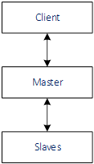
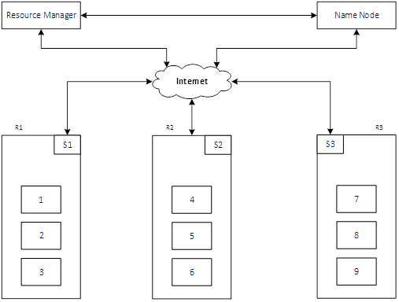
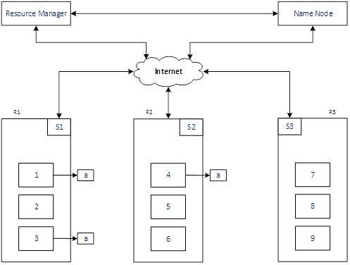
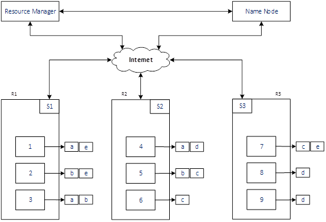
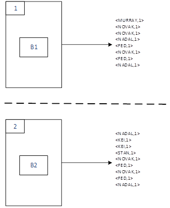
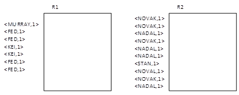
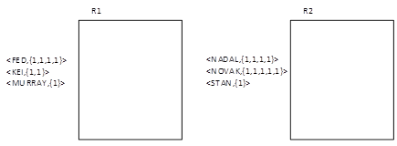
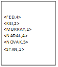

# Hadoop Ecosystem (with MapReduce as YARN Application) – Basics #

### Hadoop Ecosystem with MapReduce as YARN Application ###

Hadoop is an ecosystem that is used to store and process data. Data is stored using Hadoop Distributed File System (HDFS) and processed using MapReduce. In this ecosystem we have the Client, Master and Slaves:

- Client is used to interact with Hadoop ecosystem
- Master takes the order from Clients and give orders to Slaves
- Slaves take orders and do actual things. Slaves do the actual storage and processing of data

A high level diagram of the ecosystem is below:

###### Figure 1 ######

A more detailed diagram of the ecosystem is below:

###### Figure 2 ######

In the above figure:

- *Resource Master and Node Name*: These are Master machines that do the controlling

- *R1, R2, and R3*: These are Hardware Racks, where server machines are stacked

- *S1, S2 and S3*: These are Switches required for communication between machines. Every Rack has a Rack Switch

- *1, 2, 3, 4, 5, 6, 7, 8 and 9*: These are Slave machines

*Node Name* essentially stores the metadata. In the metadata table, it essentially stores:

- Racks configuration (also called Rack Aware). In figure2, it is:
	- R1 , R2 and R3
- Machines per Rack. In figure2, it is:
	- R1: 1, 2 and 3
	- R2: 4, 5, and 6
	- R3: 7, 8 and 9
- Slaves data

### Processes that are run on each machine ###

- Name Node: Process that runs is Name Node
- Resource Manager: Process that runs is Resource Manager
- Slave: Processes that runs are:
	- Data Node
		- Data Node communicates with Name Node
		- Data Node send data written successfully signal to Name Node
		- Data Node keeps the Name Node updated on the status. This helps Name Node to know if the Slave is down, then do the replication of data so as to maintain the replication level set.
	- Node Manager
		- Interacts with Application Manager for task processing and updating status

### Hadoop Distributed File System (HDFS) ###

HDFS is the file system used by Hadoop to store data. Block size of HDFS is 128 MB. This means any file stored in Hadoop will be divided into 128 MB blocks.

### How data is stored? ###

Let’s take an example of a file *data.txt* with size of 640MB. With the block size of 128MB, file will be divided into 5 blocks. Block name starts with *blk_*, but for our example we assume the block names are a, b, c, d and e. This example also assumes the *Replication* of 3 (default).

To store the file, *Hadoop FS Client* interacts with *Name Node* to store the blocks (a, b, c, d and e) of file *data.txt*.

As *Name Node* has information about Racks, Slaves and their Capacity, it puts the file on two Slaves on same Rack and one Slave on another Rack (considering the *Replication* value of 3). It stores data on two Slaves on the same Rack because the time to write data in the same Rack is less, than to write to another Rack, due to network latency.

Below figure shows how block ‘a’ is stored in the Hadoop ecosystem.

###### Figure 3 ######

First data is written to *S1-1*, *S1-1* will then store data to *S1-3*. And then *S1-3* will write data to *S2-4*. As soon as the data is written *Slaves* inform the *Name Node*. Once acknowledgment from all 3 *Slaves* is got by *Name Node*, the data is said to be successfully written.

Below figure shows how the file *data.txt* (with blocks a, b, c, d and e) is stored in the Hadoop ecosystem:

###### Figure 4 ######

### How data is processed? ###

When the processing request of data file *data.txt* comes from *Hadoop FS Client*, it is given to the *Resource Manager*. *Resource Manager* receives the processing request for file *data.txt* and then *Resource Manager* talks to *Name Node* to know how the data is stored. *Name Node* provides the metadata of how the *data.txt* file is stored to *Resource Manager*.

Then *Resource Manager* asks the *Node Manager* to initializes *Application Manager* and pass on the processing request and metadata to *Application Manager*.

*Application Manager* then decides where to process the block (remember that data is stored on 3 Slaves based on the default *Replication* value) based on data locality and least used machine. All the blocks are processed in Parallel. Here *Application Manager* interacts with *Node Managers*.

*Application Manager* reports the status to *Resource Manager*, and when all the processing is complete it is killed.

### MapReduce ###

There are two phases in this:

- Map
- Reduce

Let’s consider we have the data of tweets on Australian Open from Tweeter. Each tweet will contain the name of the player like #MURRAY, #NOVAK. And we want to count the number of times each player appears.

For this, we will have one file tweets.txt. This file is saved on 2 Slave machines (1 and 2) and data is divided into 2 Blocks (B1 and B2).

#### Map Phase ####

During Map Phase, below happens:

- Data is read from the blocks
- Map method is executed
- Output is written to the local memory

Each line from the block will be read and <key, value> pair will be created. See below:

###### Figure 5 ######

#### Intermediate Processes ####

After the *Map Phase*, based on the *Partitioning* decision data will be sent to the Reducer. Sending of data to the *Reducer* is called Shuffle (that starts from the Map Phase and ends at the Reduce Phase).

We will assume to have 2 Reducers (R1 and R2). Using the *Partitioning* decision, *Shuffle* will send Fed, KEI, MURRAY to Reducer1 and NADAL, NOVAL, STAN to Reducer2.

###### Figure 6 ######

#### Reduce Phase ####

During Reduce Phase, below happens:

- Sorting of data
- Reduce method is executed

The data is sorted and grouped based on the key and below output is generated. This output is fed to the Reduce method.

###### Figure 7 ######

Reduce method is executed and final output is written to HDFS.

###### Figure 8 ######