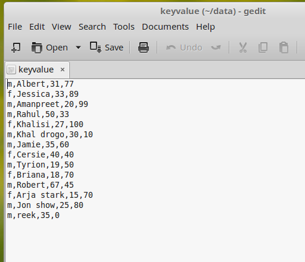
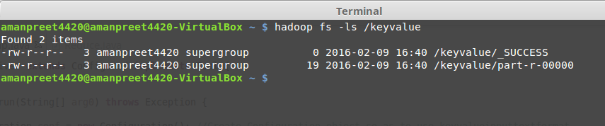
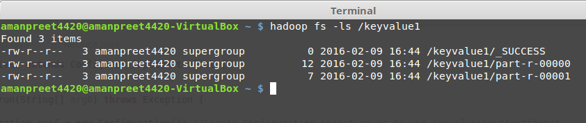
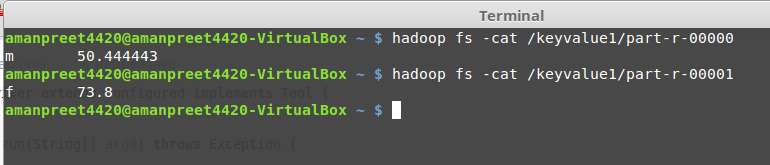

# Second MapReduce project using KeyValueTextInputFormat #

In this project, we will use another input format in MapReduce – *KeyValueTextInputFormat*. Let’s create a file *keyvalue* that contain the data of *gender,name,age,score* as:

- Use Case for the project
	- We need to find Average-Score Gender-wise

- Now put this file in HDFS

- KeyValueTextInputFormat

	- We use this format for structured data i.e. data where there is some structure like in our example it is comma delimited values – *gender,name,age,score*

	- In this input format type, the part before the first delimiter becomes the key and rest becomes value, see below:

		Key – *gender*

		Value – *name,age,score*

- Next is to create the bare-bone or bare minimum code structure for our MapReduce project (refer First *MapReduce* project).
	- We will name our package *keyvalue*

- Set the properties in *Driver* class, see below
	- Create Configuration object so as to use keyvalueinputtextformat

		> Configuration conf = new Configuration(); 

	- Comma delimited

		> conf.set("mapreduce.input.keyvaluelinerecordreader.key.value.separator", ",");

	- Singleton instance of the Job class, passing the *Configuration* object created earlier

		> Job job = Job.getInstance(conf);

	- We will set Job Name using *setJobByName* property. And we will set the *setJarByClass* property (we will use this property when we run the MapReduce job from Terminal).

		> job.setJobName("keyvalue");
		> job.setJarByClass(getClass());

	- Set Mapper class

		> job.setMapperClass(Map.class);

	- Set Reducer class

		> job.setReducerClass(Reduce.class);

	- Set the datatype of Key that Mapper outputs

		> job.setMapOutputKeyClass(Text.class);

	- Set the datatype of value that Mapper outputs
		
		> job.setMapOutputValueClass(IntWritable.class);

	- Set the datatype of Key that Reducer outputs

		> job.setOutputKeyClass(Text.class);

	- Set the datatype of value that Reducer outputs

		> job.setOutputValueClass(FloatWritable.class);

	- Set InputFormat class to *KeyValueTextInputFormat*

		> job.setInputFormatClass(KeyValueTextInputFormat.class);

	- Set the path of Input file to process

		> FileInputFormat.setInputPaths(job, new Path(arg0[0]));

	- Set the path of Final Output

		> FileOutputFormat.setOutputPath(job, new Path(arg0[1]));

	- Wait for completion of the Job

		> return job.waitForCompletion(true) ? 1 : 0;

- Let’s go to our *Map* class
	- Change the placeholders as:
		- KEYIN to Text
		- VALUEIN to Text
		- KEYOUT to Text
		- VALUEOUT to IntWritable

	- Based on our Use Case, the *map* method code is below:

		>     public void map(Text key, Text value, Context context)
		>      {
		>      	try
		>      	{
		>      		String[] values = value.toString().split(",");
		>      		
		>      		context.write(key, new IntWritable(Integer.parseInt(values[2])));
		>      	}
		>      	catch(Exception e)
		>      	{
		>      		System.out.println(e.getMessage());
		>      	}
		>      }

- Now let’s go to the *Reduce* class.
	- Change the placeholders as:
		- KEYIN to Text
		- VALUEIN to IntWritable
		- KEYOUT to Text
		- VALUEOUT to FloatWritable

	- Based on our Use Case, the *reduce* method code is below:

		>     public void reduce(Text key, Iterable<IntWritable> values, Context context)
		>     {
		>     	try
		>     	{
		>     		long totalScore = 0L;
		>     		int count = 0;
		>     		
		>     		for (IntWritable value : values)
		>     		{
		>     			totalScore += value.get();
		>     			count++;
		>     		}			
		>     			
		>     		context.write(key, new FloatWritable((float)totalScore/count));
		>     	}
		>     	catch(Exception e)
		>     	{
		>     		System.out.println(e.getMessage());
		>     	}
		>     }

- Now is the time to run our MapReduce program

	- Right-click on package -> Run As -> Run Configurations

	- Double-click *Java Applications* and select the Application created
		- Under *Arguments* tab, put below in *Program Arguments* and click *Apply*

			> hdfs://localhost:9000/datakeyvalue/keyvalue
			
			> hdfs://localhost:9000/keyvalue

	- Now click Run to run the MapReduce job

	- After the job is executed, see the output in */keyvalue*

		

		- _SUCCESS: this is a flag file, stating that the operation was successful
		- part-r-00000: this is the files containing the final output.
			- Note that there is just one file created, as the number of reducer is 1

	- Content of part-r-00000 file are below:

		

- Let’s change this Job to use two Reducers
	- In the Driver file, put below statement:

		> job.setNumReduceTasks(2);

	- Run the project and push output in /keyvalue1. We get below output

		

	- Content of both files are below:

		
	
		Note here that based on the default Partition logic, all males goes to one reducer and all females goes to the second reducer.

Next we will implement Custom Partition Logic.
