# Sqoop – Pig – Hive project #

This document discusses Sqoop, Pig and Hive architecture and use all three of these in a single end-to-end project.

The main steps of the project will be –

- To import data from MySQL database using Sqoop
- Do transformation on the imported data using Pig scripts
- Do reporting on the transformed data using Hive

### Use Case ###

For our Use Case, we will be using two files –

- daily_prices.csv
	- this contains daily stock prices like opening price, high price, low price, closing price and volume for stocks registered on TEST exchange

- dividends.csv
	- this contains the dividends data for stocks registered on TEST exchange

These two files are available on GitHub repository inside *Sqoop_Pig_Hive_Project1-> data*

We will put these two files in MySQL database. And then import the two RDBMS tables into HDFS using Sqoop.

We will then use Pig transformations, to generate Rating for each stock per year based on the price. Also we will generate Rating for each stock per year based on the dividend it gave.

Finally, we will use Hive to do reporting and analysis of the Rating data that Pig generated.

### Creating our OLTP database using MySQL ###

#### Configure MySQL ####

- The first step is to configure MySQL on our *Oracle VM Virtual Box* configured with *Linux Mint 17.2* (that is based on *Ubuntu 14.04*), using below command

	> sudo apt-get install mysql-server

	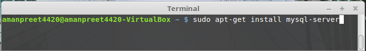

- After successful installation, you can check the installation using below command

	> mysql --version

	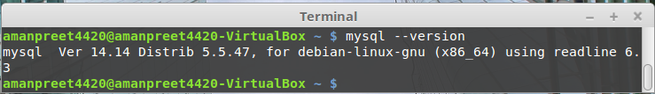

### Create database and tables in MySQL ###

- Login into MySQL, using below command

	> mysql –uroot –p

- Create database *liveproject1*, using below command

	>     create database liveproject1;
	>     use liveproject1;

- Create table *daily_price*, using below command

	>     create table daily_price
	>     (
	> 	    xchange varchar(4),
	> 	    stock_symbol varchar(10),
	> 	    trade_date date,
	> 	    opening_price float,	
	> 	    high_price float,
	> 	    low_price float,
	> 	    closing_price float,
	> 	    stock_volume long,
	> 	    adjusted_close float
	>     );

- Create table *dividends*, using below command

	>     create table dividends
	>     (
	>     	xchange varchar(4),
	>     	stock_symbol varchar(10),
	>     	div_date date,
	>     	dividend float
	>     );

### Importing data from files to tables ###

We will now be importing *daily_price.csv* and *dividends.csv* file to *daily_price* and *dividends* tables, respectively.

- For running below commands, you need to put *daily_price.csv* and *dividends.csv* files in below location

	> */home/amanpreet4420/Desktop/Sqoop_Pig_Hive_Project1/data*

- Import *daily_price.csv* to *daily_price* table, using below command from Linux terminal

	> *mysqlimport -uroot -p --local liveproject1 /home/amanpreet4420/Desktop/Sqoop_Pig_Hive_Project1/data/daily_price.csv --fields-terminated-by=','*

	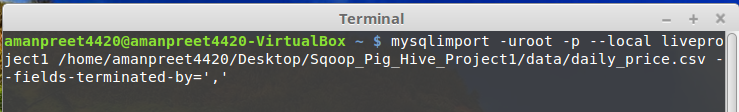

- Import *dividends.csv* to *dividends* table, using below command from Linux terminal

	> *mysqlimport -uroot -p --local liveproject1 /home/amanpreet4420/Desktop/Sqoop_Pig_Hive_Project1/data/dividends.csv --fields-terminated-by=','*
	
	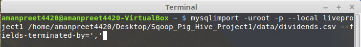

### Using Sqoop for importing MySQL liveproject1 data into HDFS ###

#### Understanding Sqoop ####

Sqoop is used to transfer data between relational database servers and Hadoop. It is used to import data from relational databases like MySQL, Oracle to Hadoop HDFS. It is also used to export data from Hadoop HDFS to relational databases.

Below diagram shows the interaction –

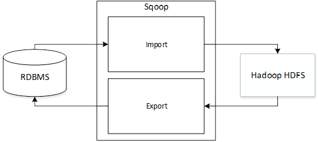

##### Sqoop Import #####
Sqoop Import is used to import tables from RDMBS to Hadoop HDFS, where each row from the table is stored as record in HDFS.

#####Sqoop Export #####
Sqoop Export exports the data from Hadoop HDFS to RDBMS, where each record is treated as a row in RDBMS table.

##### Sqoop Workflow #####
In Sqoop, commands are converted to Java code (jar files) and are executed as MapReduce jobs.

So whenever we write/execute scripts on Sqoop terminal, a set of Java code is generated containing the put and get commands.

This Java code is run using four parallel MapReduce tasks, where each task will work on the selected number of rows. This is true except when there are five rows in the table, in that case five parallel MapReduce tasks are run. We can also override this by including a parameter ‘-m 1’ while executing Sqoop scripts, this means treat the import as sequential import.

#### Installing Sqoop ####

- The first step is to download Sqoop from [http://sqoop.apache.org/](http://sqoop.apache.org/). I am using *sqoop-1.4.6.bin__hadoop-2.0.4-alpha.tar.gz* for our tutorial

- Extract the tar file in the Home directory and rename it to *sqoop-1.4.6*, see below image

	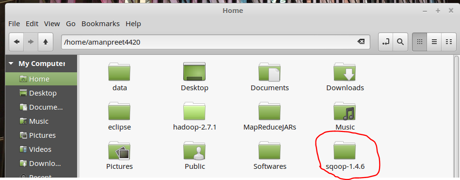

- As Sqoop uses JDBC drivers to connect to RDBS, we will need mysql connector for our MySQL database. I am using *mysql-connector-java-5.1.38.tar.gz* and you can find that on GitHub repository inside *Sqoop_Pig_Hive_Project1*

- Extract *mysql-connector-java-5.1.38.tar.gz* and copy the jar file *mysql-connector-java-5.1.38-bin.jar* to */home/amanpreet4420/sqoop-1.4.6/lib*

	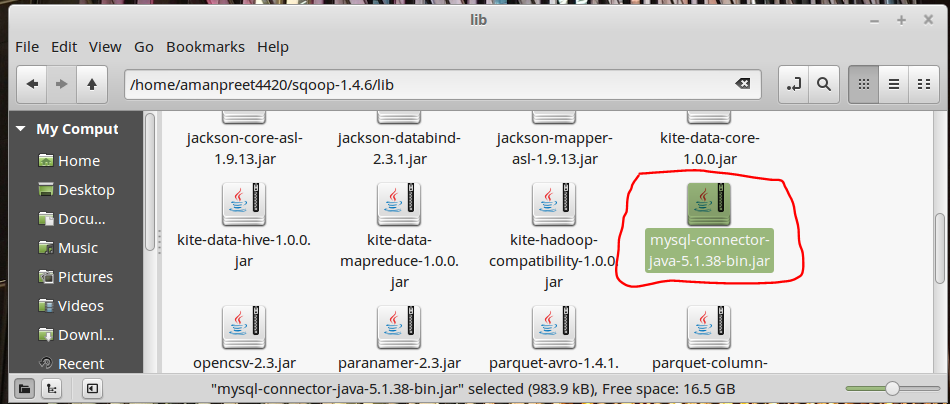

- Update the global *.bashrc* file to add the environment variables. Go to your home directory from Terminal and edit *.bashrc* file using below command

	

	- Add below lines in *.bashrc* file

		>	export HADOOP_COMMON_HOME=/home/amanpreet4420/hadoop-2.7.1
		>	
		>	export HADOOP_MAPRED_HOME=/home/amanpreet4420/hadoop-2.7.1
		>	
		>	export SQOOP_HOME=/home/amanpreet4420/sqoop-1.4.6
	
	- Update *PATH* variable as below
	
		>   export PATH=$PATH:$JAVA_HOME/bin:$HADOOP_INSTALL/bin:$SQOOP_HOME/bin

	- Your .bashrc file should look like this:

		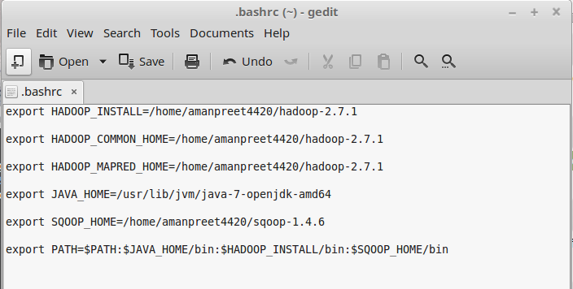

#### Let’s get back to our project now ####

- First step is to start Hadoop services, see below

	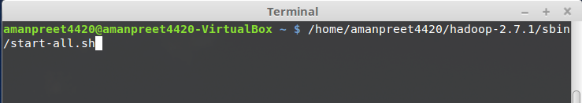

- Create directory *Sqoop_Pig_Hive_Project1* using below command

	> hadoop fs -mkdir /Sqoop_Pig_Hive_Project1

- Create a file *sqooping.sh* under */home/amanpreet4420/Desktop/Sqoop_Pig_Hive_Project1* and update its permissions using below command

	> chmod 777 sqooping.sh
	
	Check below screen shot: 

	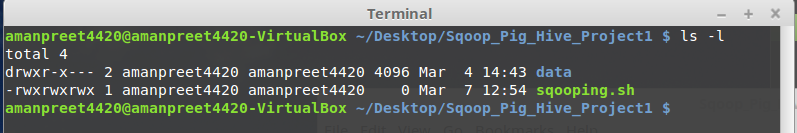	

- Import from MySQL database liveproject1 to HDFS using below commands

	> sqoop import --connect jdbc:mysql://localhost/liveproject1 --username root --password password --table daily_price --target-dir /Sqoop_Pig_Hive_Project1/daily_price -m 1

	> sqoop import --connect jdbc:mysql://localhost/liveproject1 --username root --password password --table dividends --target-dir /Sqoop_Pig_Hive_Project1/dividends -m 1

- Two directories *daily_price* and *dividends* are created under */Sqoop_Pig_Hive_Project1*, see below:

	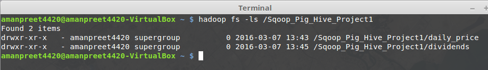

	Contents of */Sqoop_Pig_Hive_Project1/daily_price* directory:

	

	Contents of */Sqoop_Pig_Hive_Project1/daily_price/part-m-00000* file:

	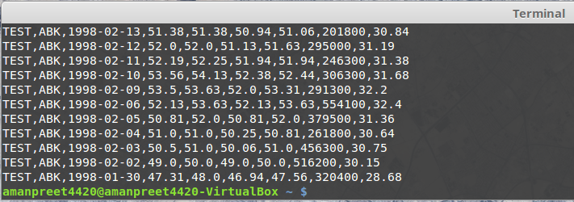

	Contents of */Sqoop_Pig_Hive_Project1/dividends* directory:

	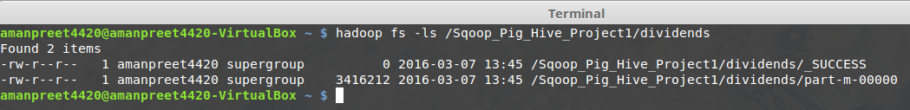

	Contents of */Sqoop_Pig_Hive_Project1/dividends/part-m-00000* file:
	
	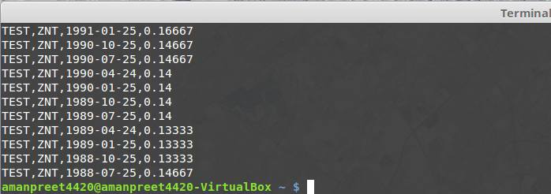

### Using Pig to run transformations on the imported data ###

#### Understanding Pig ####

Pig is an abstraction over MapReduce. Apache Pig is a data flow language.
Pig is very easy and any programmer with basic SQL knowledge can work with Pig, and don’t have to use Java for writing complex MapReduce code. Pig is different from SQL, as it uses Pig Latin which is a procedural language where schema is optional.

Pig is mainly used when there is a pipeline kind of flow, and so it fits in pipeline paradigm. Pipeline flow means doing multiple operations on the data like Read -> Grouping -> Average -> Display. Apache Pig is used to run transformations on the data imported from some RDBMS database. It transforms the data, de-normalize it and puts the transformed data back to HDFS.

Pig can handle structured, un-structured and semi-structured data.

Below is the architecture of Apache Pig:

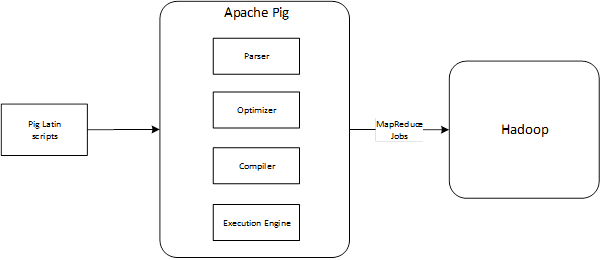

Pig Latin scripts are sent to the Parser using the Grunt shell. Parser checks the syntax of the scripts and creates a logical plan (called Direct Acyclic Graph). This logical plan is sent to the Optimizer, which does the logical optimizations such as pushdown of operations to optimize queries. This optimized logical plan is sent to the Compiler, which outputs MapReduce jobs. Finally, Execution Engine submits these MapReduce jobs to Hadoop, where they are executed and desired output is generated.

#### Installing Pig ####

- The first step is to download Pig from [https://pig.apache.org/](https://pig.apache.org/). I am using pig-0.15.0.tar.gz for our tutorial

- Extract the tar file in the Home directory, see below image

	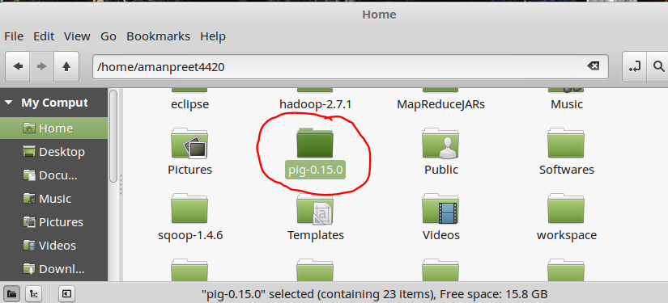

- Update the global *.bashrc* file to add the environment variables. Go to your home directory from Terminal and edit *.bashrc* file using below command

	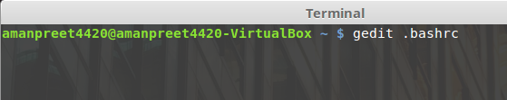

	Add below lines in .bashrc file

	> export PIG_HOME=/home/amanpreet4420/pig-0.15.0
	
	Update PATH variable as below

	> export PATH=$PATH:$JAVA_HOME/bin:$HADOOP_INSTALL/bin:$SQOOP_HOME/bin:$PIG_HOME/bin
	
	Your .bashrc file should look like this:

	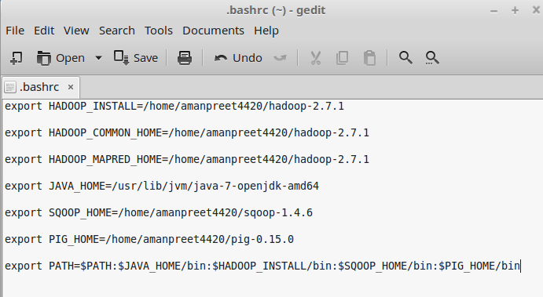

#### Let’s get back to our project now ####

- Create a file *transformations.pig* under */home/amanpreet4420/Desktop/Sqoop_Pig_Hive_Project1*. We will add all our Pig Latin statements in this file

- First Pig Latin statement is used to load the data of file */Sqoop_Pig_Hive_Project1/daily_price* from HDFS directory

	> prices = load '/Sqoop_Pig_Hive_Project1/daily_price' using PigStorage(',') as (xchange:chararray, stock_symbol:chararray, trade_date:chararray,  opening_price:float, high_price:float, low_price:float, closing_price:float, stock_volume:long,adjusted_close:float);

	- The syntax of LOAD statement is below:

		*Relation_name = LOAD 'Input file path' USING function as schema;*

		- *LOAD*
			- We are trying to load the data of file */Sqoop_Pig_Hive_Project1/daily_price* from HDFS directory into relation *prices*

		- *Input file path*
			- Input file here is  */Sqoop_Pig_Hive_Project1/daily_price*

		- *function*
			- We are using *PigStorage(‘,’)*. PigStorage that is used to load and store data as structured text files. It takes a delimiter, in our case a comma, used as a delimiter for separating the entities of a tuple

		- *schema*
			- We have to define the schema of the data. In our case it is similar to our MySQL table
			
				> *xchange:chararray, stock_symbol:chararray, trade_date:chararray,  opening_price:float, high_price:float, low_price:float, closing_price:float, stock_volume:long,adjusted_close:float)*

- Run this Pig Latin statement in Grunt shell to check the statement syntax
	- Write Pig on the command line to get to the Grunt shell, see below:

		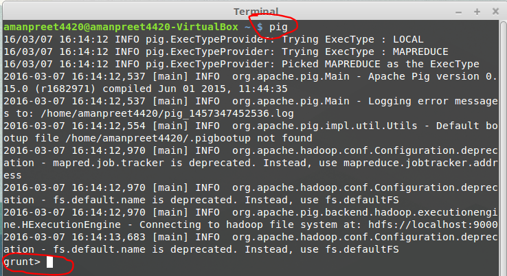

	- Run the Pig Latin statement, see below:

		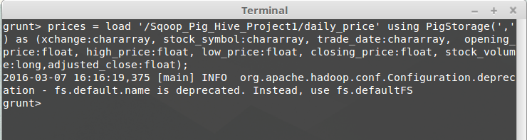

	- Describe *prices* to view the schema of *prices* relation, see below. The schema is enclosed inside curly braces, {}. Curly braces denotes the bag data type in Pig. Bag is a collection of tuples.

		In SQL terms, we can say that Tuple denotes a Row and Bag denotes a Table.

		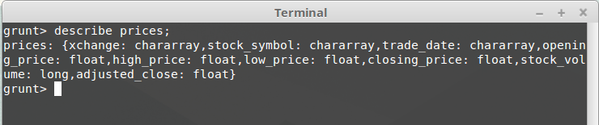

	- We can use *illustrate* to dump the sample data of any relation, see below
 		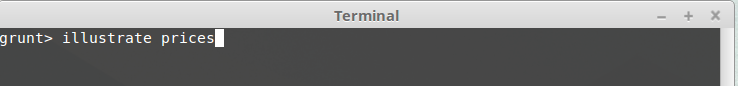

		Output from *illustrate* prices

		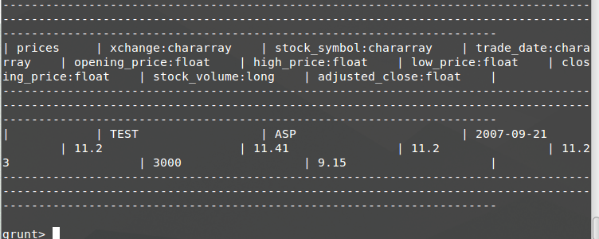

- Next Pig Latin statement is used to load the data of file */Sqoop_Pig_Hive_Project1/dividends* from HDFS directory into relation *dividends*

	> dividends = load '/Sqoop_Pig_Hive_Project1/dividends' using PigStorage(',') as (xchange:chararray, stock_symbol:chararray, div_date:chararray, dividend:float);

- Run this Pig Latin statement in Grunt shell

	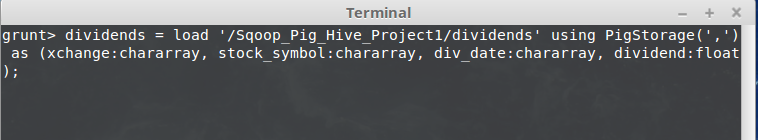

	- Describe *dividends* to view the schema, see below
	
		

	- Use *illustrate* to dump the sample data of *dividends* relation, see below

		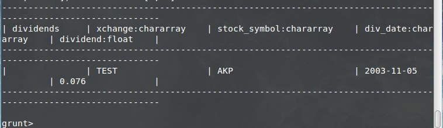	

- Next is to create a relation *prices1*. This relation uses *foreach-generate*. The *foreach* operator is used to *generate* specified data transformations based on the column data.

	Here we are iterating over each tuple in *prices* relation, generating *stock_symbol*, year from *trade_date* and *closing_price*.

	> prices1 = foreach prices generate stock_symbol, SUBSTRING(trade_date,0,4) as year, closing_price;

- Run this Pig Latin statement in Grunt shell

	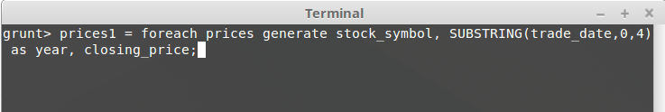

	- Describe *prices1* to view the schema, see below
	
		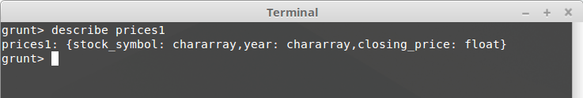
	
	- Use *illustrate* to dump the sample data of *prices1* relation, see below

		

- Now we will group *prices1* data based on *stock_symbol* and *year*, and put in relation *prices1_grp*.

	> prices1_grp = group prices1 by (stock_symbol, year);

- Run this Pig Latin statement in Grunt shell

	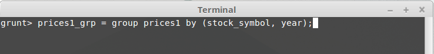

	- Describe *prices1_grp* to view the schema, see below
	
		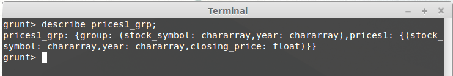

		- *prices1_grp* relation is a bag, that contains –
			- *group*: this is a tuple containing *stock_symbol* and *year*
			- *prices1*: this is the *prices1* relation, which is a bag containing tuples with matching *stock_symbol* and *year*

		- *illustrate prices1_grp* relation to understand the data better.

	- Use *illustrate* to dump the sample data of *prices1_grp* relation, see below
	
		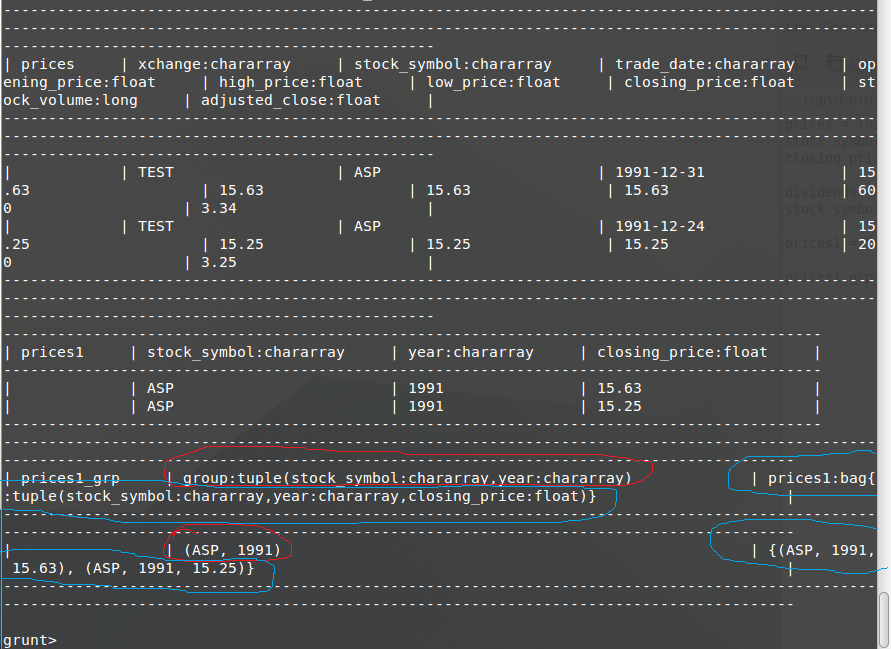	

		- Look at the *prices1_grp* relation sample data.
			- *group:tuple(stock_symbol:chararray,year:chararray)*
				- corresponds to tuple *(ASP, 1991)*

			- *prices1:bag{:tuple(stock_symbol:chararray,year:chararray,closing_price:float)}*
				- corresponds to bag *{(ASP, 1991, 15.63), (ASP, 1991, 15.25)}*

- Next is to create *prices2* relation from *prices1_grp* relation

	- Here we are iterating over *prices1_grp* relation, generating *stock_symbol*, *year*, variance between *closing_prices* for each *stock_symbol* and *year*, average of *closing_prices* for each *stock_symbol* and *year*, percentage variance of *closing_prices* for each *stock_symbol* and *year*.

		> prices2 = foreach prices1_grp generate group.stock_symbol as stock_symbol, group.year as year, (MAX(prices1.closing_price)-MIN(prices1.closing_price)) as variance, AVG(prices1.closing_price) as avg_closing_price, (((MAX(prices1.closing_price)-MIN(prices1.closing_price))/AVG(prices1.closing_price))*100) as per_variance;

- Run this Pig Latin statement in Grunt shell
 
	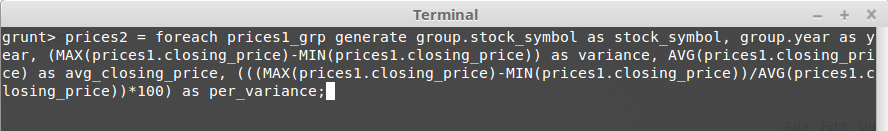

	- Describe *prices2* to view the schema, see below
 
		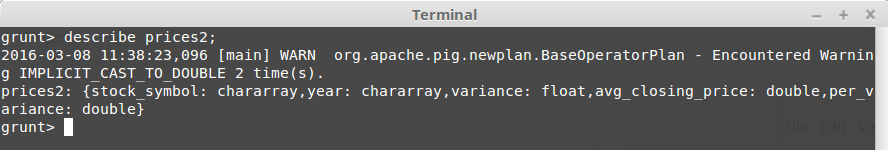

	- Use *illustrate* to dump the sample data of *prices2* relation, see below

		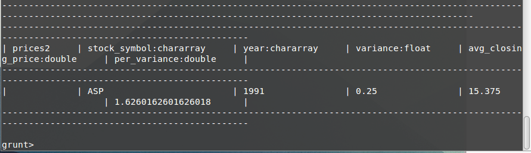

		Look at the *prices2* relation sample data. It has the *stock_symbol*, *year*, *variance*, average (*avg_closing_price*) and percentage variance (*per_variance*)

- Now we will work with *dividends* relation. We will iterate on *dividends* relation using foreach-generate, generate *stock_symbol*, *year* from *div_date*, *dividend* and put this in relation *div1*.

	> div1 = foreach dividends generate stock_symbol, SUBSTRING(div_date,0,4) as year, dividend;

- Run this Pig Latin statement in Grunt shell

	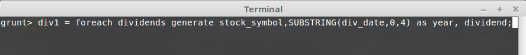

	- Describe *div1* to view the schema, see below
 
		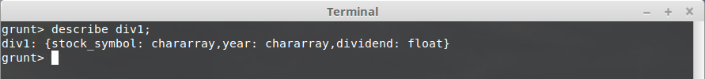

	- Use *illustrate* to dump the sample data of *div1* relation, see below

		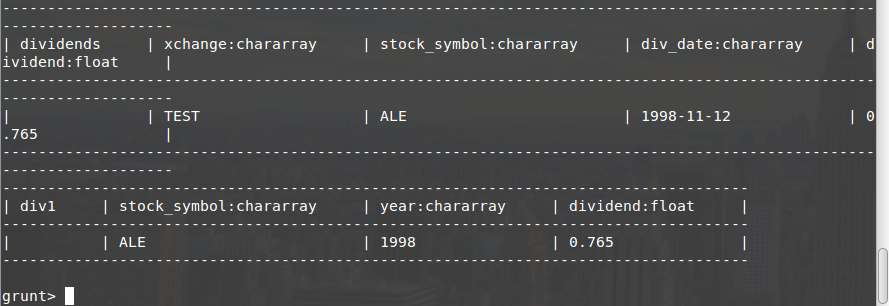

- Next we will group *div1* relation using *stock_symbol* and *year*, and put in *div1_grp* relation

	> div1_grp = group div1 by (stock_symbol, year);

- Run this Pig Latin statement in Grunt shell

	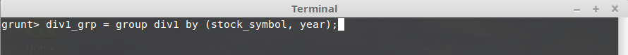

	- Describe *div1_grp* to view the schema, see below

		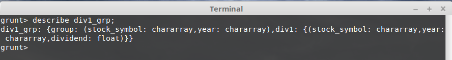

		*div1_grp* relation is a bag, that contains –
		- *group*: this is a tuple containing *stock_symbol* and *year*
		- *div1*: this is the div1 relation, which is a bag containing tuples with matching *stock_symbol* and *year*

		*illustrate* *div1_grp* relation to understand the data better.

	- Use *illustrate* to dump the sample data of *div1_grp* relation, see below

		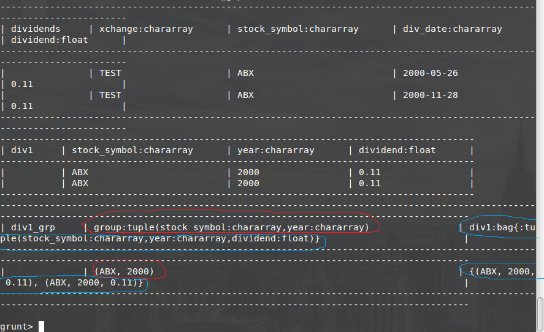

		Look at the *div1_grp* relation sample data
		- *group:tuple(stock_symbol:chararray,year:chararray)*
			- corresponds to tuple *(ABX, 2000)*

		- *div1:bag{:tuple(stock_symbol:chararray,year:chararray,dividend:float)}* 
			- corresponds to bag *{(ABX, 2000, 0.11), (ABX, 2000, 0.11)}*

- Now we will create *div2* relation from *div1_grp* relation.

	Here we will iterate over *div1_grp* relation, generating *stock_symbol*, *year* and sum of *dividend* for each *stock_symbol* and *year*.

	> div2 = foreach div1_grp generate group.stock_symbol as stock_symbol, group.year as year, SUM(div1.dividend) as final_dividend;

- Run this Pig Latin statement in Grunt shell

	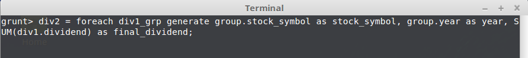

	- Describe *div2* to view the schema, see below

		

	- Use *illustrate* to dump the sample data of *div2* relation, see below

		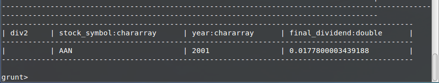

		Look at the *div2* relation sample data. It has the *stock_symbol*, *year*, *final_dividend*

- Now we will generate Rating for each stock per year based on the closing price.

	Here we will iterate *prices2* relation, generating *stock_symbol*, *year* and  *prating*. Formula for calculating prating is as:

	> per_variance <= 5 then rating is 10 

	> per_variance > 5 AND per_variance <= 10 then rating is 9

	> per_variance > 10 AND per_variance <= 15 then rating is 8

	> per_variance > 15 AND per_variance <= 20 then rating is 7

	> per_variance > 20 AND per_variance <= 25 then rating is 6

	> per_variance > 25 AND per_variance <= 30 then rating is 5

	> per_variance > 30 AND per_variance <= 35 then rating is 4

	> per_variance > 35 AND per_variance <= 40 then rating is 3

	> per_variance > 40 AND per_variance <= 45 then rating is 2

	> per_variance > 45 AND per_variance <= 50 then rating is 1

	> per_variance > 50 then rating is 0

		> prices_rating = foreach prices2 generate stock_symbol, year, (per_variance <= 5 ? 10 : (per_variance > 5 AND per_variance <= 10 ? 9 : (per_variance > 10 AND per_variance <= 15 ? 8 : (per_variance > 15 AND per_variance <= 20 ? 7 : (per_variance > 20 AND per_variance <= 25 ? 6 : (per_variance > 25 AND per_variance <= 30 ? 5 : (per_variance > 30 AND per_variance <= 35 ? 4 : (per_variance > 35 AND per_variance <= 40 ? 3 : (per_variance > 40 AND per_variance <= 45 ? 2 : (per_variance > 45 AND per_variance <= 50 ? 1 : 0)))))))))) as prating;

- Run this Pig Latin statement in Grunt shell
 
	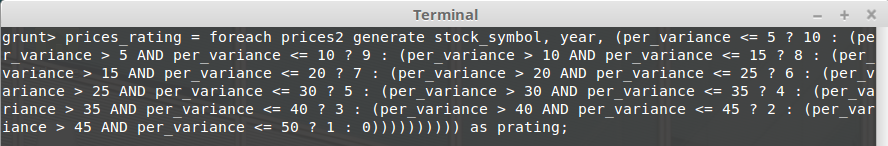

	- Describe *price_rating* to view the schema, see below

		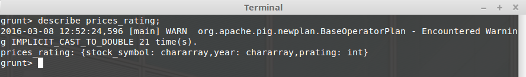

	- Use *illustrate* to dump the sample data of *price_rating* relation, see below

		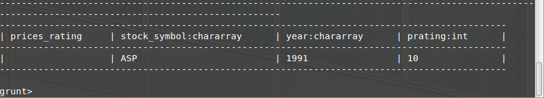

	Look at the *prices_rating* relation sample data. It has the *stock_symbol*, *year*, *prating data*, which is the Rating for Stock Symbol ASP and Year 1991.

- Now we will also generate Rating for each stock per year based on the dividend

	Here we will iterate *div2* relation, generating *stock_symbol*, *year* and *drating*. Formula for calculating drating is as:

	> final_dividend >= 1 then rating is 10
	> final_dividend < 1 and final_dividend >= .9 then rating is 9
	> 
	> final_dividend < .9 and final_dividend >= .8 then rating is 8
	> 
	> final_dividend < .8 and final_dividend >= .7 then rating is 7
	> 
	> final_dividend < .7 and final_dividend >= .6 then rating is 6
	> 
	> final_dividend < .6 and final_dividend >= 0.5 then rating is 5
	> 
	> final_dividend < 0.5 and final_dividend >= 0.4 then rating is 4
	> 
	> final_dividend < .4 and final_dividend >= .3 then rating is 3
	> 
	> final_dividend < .3 and final_dividend >= .2 then rating is 2
	> 
	> final_dividend < .2 and final_dividend >= .1 then rating is 1
	> 
	> final_dividend < .1 then rating is 0

		>     div_rating = foreach div2 generate stock_symbol, year, (final_dividend >= 1 ? 10 : (final_dividend < 1 and final_dividend >= .9 ? 9 : (final_dividend < .9 and final_dividend >= .8 ? 8 : (final_dividend < .8 and final_dividend >= .7 ? 7 : (final_dividend < .7 and final_dividend >= .6 ? 6 : (final_dividend < .6 and final_dividend >= .5 ? 5 : (final_dividend < .5 and final_dividend >= .4 ? 4 : (final_dividend < .4 and final_dividend >= .3 ? 3 : (final_dividend < .3 and final_dividend >= .2 ? 2 : (final_dividend < .2 and final_dividend >= .1 ? 1 : 0)))))))))) as drating;

- Run this Pig Latin statement in Grunt shell

	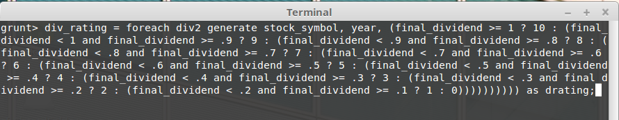

	- Describe *div_rating* to view the schema, see below
	
		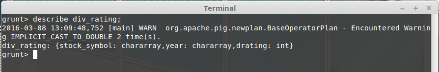

	- Use *illustrate* to dump the sample data of *div_rating* relation, see below

		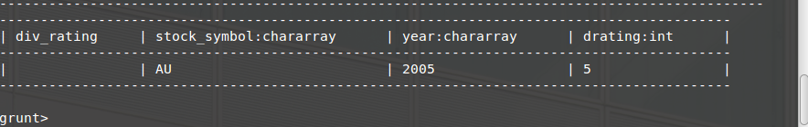

	Look at the *div_rating* relation sample data. It has the *stock_symbol*, *year*, *drating data*, which is the Rating for Stock Symbol AU and Year 2005.

- Next step is to create a single relation, *rating*, using *price_rating* and *div_rating*. This new relation will be the Full Outer Join of both the relations.

	Here we are joining *price_rating* and *div_rating* using *stock_symbol* and *year*.

	> rating = join prices_rating by (stock_symbol, year) full, div_rating by (stock_symbol, year);

- Run this Pig Latin statement in Grunt shell

	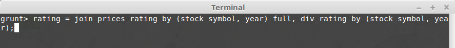

	- Describe rating to view the schema, see below
 		
		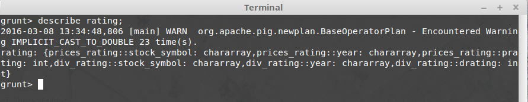

	- This *rating* relation is a bag containing:
		> prices_rating::stock_symbol: chararray,prices_rating::year: chararray,prices_rating::prating: int
		
		> div_rating::stock_symbol: chararray,div_rating::year: chararray,div_rating::drating: int

	- Use *illustrate* to dump the sample data of rating relation, see below

		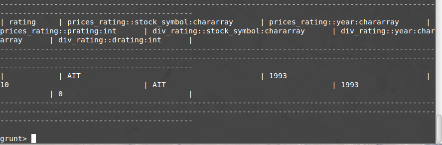

- There is one more thing we have to do. As we created Full Outer Join of *prices_rating* and *div_rating* relations, we have to check for null values as below:
	- if prices_rating::stock_symbol is null then use div_rating::stock_symbol else use prices_rating::stock_symbol
	- if prices_rating::year is null is null then use div_rating::year else use prices_rating::year

	For that we have created a final relation, rating_final, which will check for nulls

	> rating_final = foreach rating generate (prices_rating::stock_symbol is null ? div_rating::stock_symbol : prices_rating::stock_symbol) as stock_symbol, (prices_rating::year is null ? div_rating::year : prices_rating::year) as year, prices_rating::prating as prating, div_rating::drating as drating;

- Run this Pig Latin statement in Grunt shell

	

	- Describe *rating_final* to view the schema, see below

		

	- Use *illustrate* to dump the sample data of *rating_final* relation, see below

		

- Finally, we will use *store* command to store the data in HDFS. *store* command is used to trigger the operations written in Pig Latin script.

	> store rating_final into '/stock_rating';

	Here, the above command will trigger all the operations in our script and store the resultant relation *rating_final* data to the directory *stock_rating* in HDFS.

	When we use the *store* command, logical plan (DAG) is created which is then sent to the Optimizer. Optimizer then does the logical optimizations and send this optimized logical plan to the Compiler. Compiler then outputs the MapReduce jobs which are submitted to Hadoop by the Execution Engine to generate the desired output.

- Now we will run the script written in *transformations.pig* file from Linux terminal. But before that, we have to start the Job History server

	- Start the Job History server

		> ./hadoop-2.7.1/sbin/mr-jobhistory-daemon.sh start historyserver

	- Run *transformations.pig* file

		> pig -f '/home/amanpreet4420/Desktop/Sqoop_Pig_Hive_Project1/transformations.pig'

		

	- After the script in *transformations.pig* file is execute successfully, a new directory *stock_rating* will be created in HDFS. See below the contents of *stock_rating* file:

		

### Using Hive to do Analysis and Reporting on the Ratings data generated by Pig ###

#### Understanding Hive ####

Hive sits on top of Hadoop and makes querying and analysing easy. And it is also called a data warehouse infrastructure tool to process structured data.
Hive use Hive Query Language or HiveQL or HQL which is a query processing language similar to SQL, and is used to do MapReduce operations.

Hive is used for end user reporting. In Hive, a bunch of operations are run in a holistic approach whereas in Pig there is a pipeline kind of flow, the kind that we created in *transformations.pig* file.

Below is the architecture of Hive:

Components in Hive Architecture are:

- Command line interface
	- This is the interface for submitting queries to Hive

- Driver
	- This is the component that receives all the queries. This component provides the execute and fetch APIs for our queries

- Complier
	- This component parses the query and generate the execution plan. It get the data from MetaStore for generating the execution plan

- Metastore
	- This component stores the metadata of tables, its columns, column type, HDFS file location information, partition information, delimiter used

- Execution Engine
	- This component executes the execution plan from Compiler. Execution Engine executes the plan stages either on Metastore or sends them to Hadoop for execution of MapReduce job

Workflow of a Hive query:

- Command line Interface calls the execute interface exposed by the Driver, using Execute Query
- The Driver then send the query to Compiler to generate the execution plan, using Get Plan
- Compiler then connects with Metastore to get the required metadata, using Get Metadata and Send Metadata
- The execution plan generated by the Compiler is a Direct Acyclic Graph (DAG) where each stage is either a MapReduce job or Metadata operation
- The execution plan is then passed to the Execution Engine thru the Driver, using Send Plan and Execute Plan
- The Execution Engine submits the stages in execution plan to either Hadoop for processing of MapReduce job or to Metastore for metadata operations
- For queries, the data is read by the Execution Engine and sent to the Command line interface, using Fetch Results

#### Installing Hive ####

- The first step is to download Hive from [https://hive.apache.org/](https://hive.apache.org/). I am using *apache-hive-1.2.1-bin.tar.gz* for our tutorial

- Extract the tar file in the Home directory, see below image

	

- Update the global *.bashrc* file to add the environment variables. Go to your home directory from Terminal and edit *.bashrc* file using below command

	

	Add below lines in *.bashrc* file

	> export HIVE_HOME=/home/amanpreet4420/hive-1.2.1
	
	Update *PATH* variable as below

	> export PATH=$PATH:$JAVA_HOME/bin:$HADOOP_INSTALL/bin:$SQOOP_HOME/bin:$PIG_HOME/bin:$HIVE_HOME/bin
	
	Your *.bashrc* file should look like this:

	

- Now run Hive from the command line, see below:

	

- After we run Hive, a new directory is created in the Home directory, metastore_db. This is the Derby database instance as Hive by default comes with Derby as its metastore storage. This is used by Hive to store the metadata only.

	Metastore stores the metadata of tables, its columns, column type, HDFS file location information, partition information, delimiter used.

	

- Let’s creates a database *testing* in Hive, see below:

	

	By default, all data related to Hive is stored in HDFS directory */user/hive/warehouse*, see below

	

	When we created the database *testing*, a new directory is created *testing.db* to store data related to *testing* database

- Next create a table *sample* inside *testing* database, see below 

	

	Now check, a new directory *sample* is created inside *testing.db* to store data related to table *sample*, see below

	

- Let’s now insert a row in table *sample*, see below 

	

	Here a MapReduce job is run for the insert HQL. This HQL is converted into MapReduce job that created a file *000000_0* inside sample directory, see below

	

	Below are the contents of this file. This file has the data that we inserted using HQL

	

- Now we will drop the table *sample* and database *testing*, see below

	

	Dropping the table and database, deleted the data associated with it. See below, now the directory *training.db* is not present

	

	To avoid this, we can create external tables. Advantage of creating external tables, is that the data is not lost when table is dropped. We create external tables like below

	> create external table sample (id int, name string);

#### Let’s get back to our project now ####

- Create a file *create_stock_rating.hql* under */home/amanpreet4420/Desktop/Sqoop_Pig_Hive_Project1*. We will add all our Hive Query Language (HiveQL or HQL) queries in this file

- Create database *sqoop_pig_hive_project1* and put below command in the file

	> use sqoop_pig_hive_project1;

- Create an external table in Hive *stock_rating* that will read data from the HDFS location */stock_rating*

	>     create external table if not exists stock_rating
	>     (
	>     	stock_symbol string,
	>     	year int,
	>     	prating	int,
	>     	drating int
	>     )
	>     row format delimited
	>     fields terminated by '\t'
	>     location '/stock_rating';

	- location
		- here we will be reading data from HDFS location */stock_rating* where our Pig script, *transformation.pig*, has stored final data
	- \t
		- as the data in */stock_rating* is tab delimited, we will be reading data in tab delimited format

- Now we will run the scripts written in *create_stock_rating.hql* file from Linux terminal, see below

	> hive -f '/home/amanpreet4420/Desktop/Sqoop_Pig_Hive_Project1/create_stock_rating.hql'

	

- We can check that *stock_rating* table is created in *sqoop_pig_hive_project1* database, see below 

	

- We can check *stock_rating* table schema, see below

	

- Now we can run various analysis queries on *stock_rating* table. Below are some

	> select count(*) from stock_rating;

	

	> select count(*) from stock_rating where prating is not null;

	

	> select * from stock_rating where prating is not null;
	
	

	> select count(*) from stock_rating where drating is not null;

	

	> select * from stock_rating where drating is not null;
	
	

	> select count(*) from stock_rating where drating is not null and prating is not null;
	
	
	
	> select * from stock_rating where drating is not null and prating is not null;

	

	

### Conclusion ###

Referring again to our Use Case, we have completed below in our project

- We imported two files (daily_prices.csv and dividends.csv) into MySQL database tables

- Then we imported MySQL database tables into HDFS using Sqoop

- We then did lots of transformations on the imported data using Pig and generated Rating for each stock per year based on the price, and Rating for each stock per year based on the dividend

- Finally, we used Hive for reporting and analysis of the Rating data that Pig generated

This completes our project involving Sqoop, Pig and Hive.
