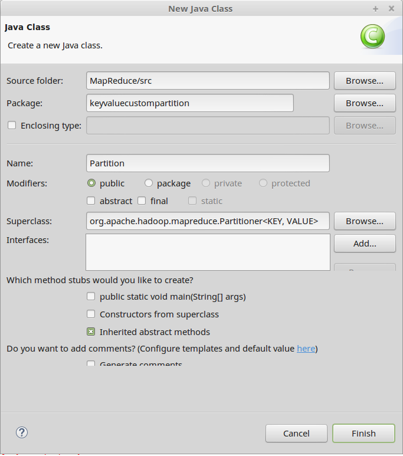
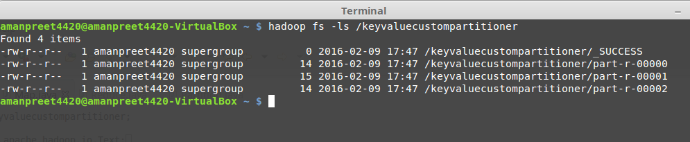
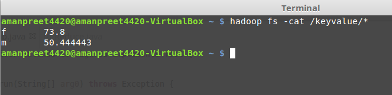

# Third MapReduce project using Custom Partitioner #

- Use Case
	- This project is built on top of *Second MapReduce project using KeyValueTextInputFormat* project.
	- In this Use Case, we want to find Gender-wise->Age-wise->Average-Score
	- Let’s consider below sample data

		> m,Albert,31,77
		> 
		> f,Jessica,33,89
		>
		> m,Amanpreet,20,99

		- Input to mapper
	
			> key – gender
			
			> value - Albert,31,77

		- Output from mapper

			> key – gender

			> value – 31,77

	- Also, we assume below logic for Partition
		- <= 20
		- >= 21 && <= 30
		- >= 31

- Next is to create the bare-bone or bare minimum code structure for our MapReduce project (refer *First MapReduce* project).
	- We will name our package *keyvaluecustompartition*

- Map class code is below:

	>     public class Map extends Mapper<Text, Text, Text, Text> {
	>          public void map(Text key, Text value, Context context)
	>          {
	>               try
	>               {
	>                    String[] values = value.toString().split(",");
	>          						
	>                    String outValue = values[1].trim() + "," + values[2].trim();
	>          
	>                    context.write(key, new Text(outValue));
	>               }
	>               catch(Exception e)
	>               {
	>                    System.out.println(e.getStackTrace());
	>               }
	>          }
	>     }

- Create a new class *Partition*
	- Superclass: *org.apache.hadoop.mapreduce.Partitioner<KEY, VALUE>*
		
		

	- Set placeholders as below:
		- KEY to Text
		- VALUE to Text

	- Add the unimplemented method getPartition(..) from base class

	- Based on our Use Case, below is the logic of getPartition(..) method

		- age <= 20 : send to Reducer 1
		- age >= 21 and age <= 30 : send to Reducer 2
		- else : send to Reducer 3

		below is the code:

		>     public int getPartition(Text key, Text value, int numReduceTasks) {
		>     		
		>     	try
		>     	{
		>     		String[] values = value.toString().split(",");
		>     		
		>     		int age = Integer.parseInt(values[0]);
		>     		
		>     		if(age <= 20)
		>     		{
		>     			return 0;
		>     		}
		>     		else if (age >=21 && age <= 30)
		>     		{
		>     			return 1;
		>     		}
		>     		else 
		>     		{
		>     			return 2;
		>     		}
		>     	}
		>     	catch(Exception e)
		>     	{
		>     		System.out.println(e.getMessage());
		>     	}
		>     		
		>     	return 0;
		>     }

- Driver class remains same to Driver class from *Second MapReduce* project using *KeyValueTextInputFormat* project, with few additions below:

	- Set Number of Reducers to 3

		> job.setNumReduceTasks(3);

	- Set Partitioner class

		> job.setPartitionerClass(Partition.class);

	- Set the datatype of value that Mapper outputs

		> job.setMapOutputValueClass(Text.class);

- Now Reduce method will receive input like this:

		> <m,{(33,77),(33,88),(20,99)}>

- Reduce class changes based on our Use Case is below:

	>     public class Reduce extends Reducer<Text, Text, Text, FloatWritable> {
	>     
	>     	public void reduce(Text key, Iterable<Text> values, Context context)
	>     	{
	>     		try
	>     		{
	>     			long totalScore = 0L;
	>     			int count = 0;
	>     			
	>     			for (Text value : values){
	>     				String[] reduceValues = value.toString().split(",");
	>     				totalScore += Long.parseLong(reduceValues[1]);
	>     				count++;
	>     			}			
	>     			
	>     			context.write(key, new FloatWritable((float)totalScore/count));
	>     		}
	>     		catch(Exception e)
	>     		{
	>     			System.out.println(e.getMessage());
	>     		}
	>     	}
	>     }

- Now is the time to run our MapReduce program
	- Create the JAR file and run the Job from Terminal using

		*hadoop jar /home/amanpreet4420/MapReduceJARs/keyvaluecustompartitioner.jar keyvaluecustompartitioner.Driver /datakeyvalue/keyvalue /keyvaluecustompartitioner*

	- After the job is executed, see the output in /keyvaluecustompartitioner

		

		- _SUCCESS: this is a flag file, stating that the operation was successful
		- part-r-00000: this is the files containing the final output from Reducer 1
		- part-r-00001: this is the files containing the final output from Reducer 2
		- part-r-00002: this is the files containing the final output from Reducer 3

	- Content of the three files are below. The output is based on our Custom Partitioner logic:
	
		
